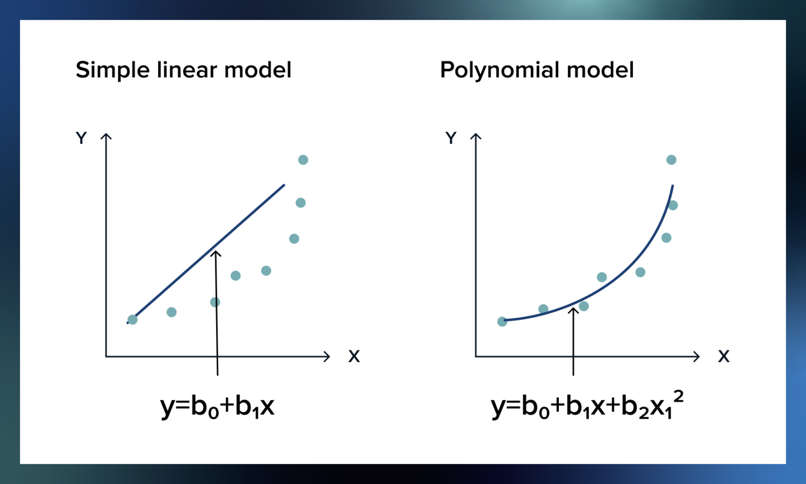

# Регрессия

## Определение

Регрессия в машинном обучении - это метод, который используется 
для предсказания количественной зависимой переменной (целевой переменной) 
на основе входных данных (признаков). 

Цель регрессии состоит в том, чтобы построить математическую модель, 
которая может описать связь между входными признаками и целевой переменной. 

## Об алгоритмах регрессии

В машинном обучении существует несколько различных методов регрессии, 
включая линейную регрессию, полиномиальную регрессию, 
регрессию на основе деревьев решений и другие. Каждый метод имеет свои 
особенности и применяется в зависимости от характеристик данных 
и требуемой точности предсказаний. 

Ниже перечислены некоторые популярные алгоритмы регрессии: 
 
1. Линейная регрессия (Linear Regression): 
Это один из самых простых и широко используемых алгоритмов регрессии. 
Он строит линейную модель, которая наилучшим образом соответствует данным 
путем минимизации суммы квадратов разностей между фактическими 
и предсказанными значениями. 
 
2. Ридж-регрессия (Ridge Regression): 
Этот алгоритм регрессии является модификацией линейной регрессии, 
которая включает регуляризацию. Регуляризация помогает управлять 
сложностью модели и предотвращает переобучение. 
 
3. Lasso-регрессия (Lasso Regression): 
Это еще один метод регуляризации линейной регрессии, который помогает в 
отборе наиболее значимых признаков. Lasso-регрессия может автоматически 
установить веса некоторых признаков в ноль, что позволяет сделать отбор 
признаков. 
 
4. Полиномиальная регрессия (Polynomial Regression): 
Этот алгоритм регрессии позволяет моделировать нелинейные зависимости 
между признаками и целевой переменной. Он добавляет полиномиальные 
признаки в модель, чтобы учесть нелинейные эффекты.