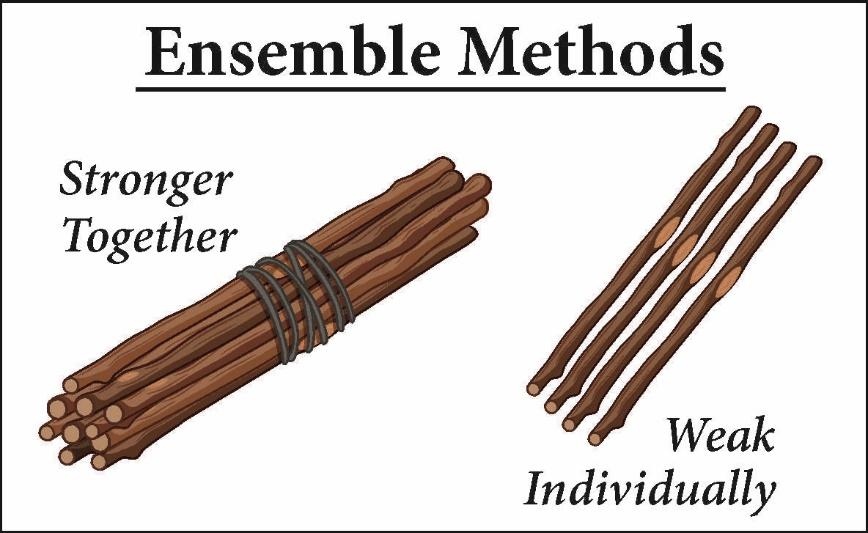

# Ансамблевые методы

## Определение

> Ансамблевые методы в машинном обучении - это подход, 
при котором несколько моделей объединяются вместе 
для решения задачи прогнозирования или классификации. 

> Они основаны на идее, что объединение прогнозов нескольких 
моделей может привести к лучшей обобщающей способности 
и более точным результатам, чем использование отдельных 
моделей. 
 
## Типы ансамблевых методов

Существует несколько типов ансамблевых методов, но 3 
наиболее распространенных - это стекинг, бэггинг и бустинг. 
 
- **Стекинг** (Stacking) - это метод, при котором несколько моделей 
обучаются независимо друг от друга, а затем их прогнозы 
используются в качестве входных данных для другой модели, 
называемой метамоделью. Метамодель обучается на основе 
прогнозов первичных моделей, чтобы получить окончательный 
прогноз. 

- **Бэггинг** (Bagging) - это метод, при котором несколько 
моделей обучаются независимо друг от друга на различных 
подмножествах обучающих данных. Затем прогнозы каждой модели 
комбинируются, например, путем усреднения или голосования, 
чтобы получить окончательный прогноз. Примером бэггинга 
является случайный лес (Random Forest), который объединяет 
прогнозы нескольких деревьев решений. 

 
- **Бустинг** (Boosting) - это метод, при котором модели 
обучаются последовательно, каждая следующая модель пытается 
исправить ошибки предыдущей модели. Каждая модель фокусируется 
на примерах, на которых предыдущие модели ошиблись. Прогнозы 
всех моделей комбинируются, обычно с использованием 
взвешенного голосования, чтобы получить окончательный прогноз. 
Примерами бустинга являются градиентный бустинг (Gradient Boosting) и адаптивный бустинг (AdaBoost). 
 
