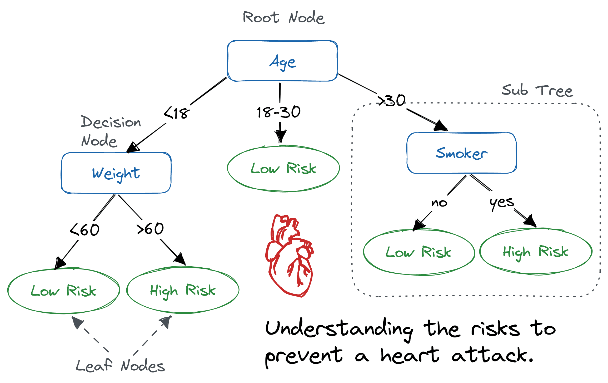

# Деревья решений (Decision tree)

> Дерево решений - то метод машинного обучения, который используется 
для классификации и регрессии.

> Оно представляет собой структуру в виде дерева, где каждый узел 
представляет собой тест на определенное свойство, а каждая ветвь соответствует возможному результату теста.  

##  Процесс построения дерева

Процесс построения решающего дерева включает следующие шаги: 
 
1. **Выбор признака для разделения**: На первом шаге выбирается признак, 
который наилучшим образом разделяет обучающие данные. 
Для этого используются различные критерии, такие как **Энтропия** или **Джини**, 
для измерения неопределенности или ошибки классификации при разделении данных по данному признаку. 

2. **Разделение данных**: После выбора признака происходит разделение данных 
на основе его значений. Если признак является числовым, то можно выбрать 
пороговое значение, чтобы разделить данные на две группы. Если признак категориальный, 
то каждая категория будет представлена отдельной ветвью в дереве. 
 
3. **Рекурсивное разделение**: После разделения данных на основе выбранного признака процесс повторяется для каждого поддерева. То есть, для каждого поддерева выбирается новый признак и происходит разделение данных снова. Этот процесс продолжается до достижения критерия остановки, например, когда достигнута определенная глубина дерева или количество объектов в узле становится недостаточным для дальнейшего разделения. 
 
4. **Создание листовых узлов**: Когда разделение данных больше не возможно, 
достигается листовой узел. Листовой узел представляет собой конечный результат классификации 
или регрессии. Например, в задаче классификации это может быть метка класса, 
а в задаче регрессии - предсказанное числовое значение. 
 
5. **Построение дерева**: После завершения процесса разделения данных и создания листовых узлов, 
решающее дерево полностью построено. Оно представляет собой иерархическую структуру, 
где каждый узел соответствует тесту на определенное свойство, а каждая ветвь соответствует возможному результату теста. 

## Плюсы и минусы решающих деревьев

### Плюсы

1. **Интерпретируемость**: 
Решающие деревья предоставляют простую и понятную интерпретацию результатов. 
Вы можете легко понять, какие признаки наиболее важны для классификации или регрессии, 
и какие решения принимаются на основе этих признаков. 
 
2. **Обработка различных типов данных**: Решающие деревья могут обрабатывать как числовые, 
так и категориальные данные без необходимости предварительного масштабирования или преобразования данных. 
Это делает их гибкими для использования в различных сценариях. 
 
3. **Работа с большими наборами данных**: Решающие деревья могут обрабатывать большие объемы данных 
сравнительно быстро. Они имеют линейную сложность относительно количества объектов в обучающем наборе данных. 
 
4. **Устойчивость к выбросам**: Решающие деревья могут быть устойчивы к выбросам и шуму в данных. 
Они основываются на принципе разделения данных на основе информационных выигрышей, 
что позволяет им игнорировать выбросы или шумовые значения. 

### Минусы  

1. **Склонность к переобучению**: Решающие деревья могут склоняться к переобучению, 
особенно если дерево слишком глубокое или имеет слишком много признаков. 
Это может привести к плохой обобщающей способности модели на новых данных. 
 
2. **Неустойчивость к изменениям в данных**: Решающие деревья могут быть чувствительны 
к небольшим изменениям в данных. Даже незначительное изменение в обучающем наборе 
может привести к существенным изменениям в структуре и результате дерева. 
 
3. **Проблема мультиколлинеарности**: Решающие деревья не обрабатывают мультиколлинеарность 
(высокую корреляцию) между признаками. Это может привести к неопределенности при выборе 
наилучшего признака для разделения. 
 
4. **Ограниченность в решении сложных задач**: Решающие деревья могут иметь ограниченные возможности 
в решении сложных задач, требующих более сложных моделей или алгоритмов. В таких случаях 
может потребоваться использование ансамблей деревьев или других методов машинного обучения. 

## Для каких задач можно использовать Решающие деревья?

Решающие деревья могут быть использованы для решения различных задач машинного обучения, включая: 
 
1. **Классификация**: Решающие деревья могут быть использованы для классификации объектов в различные 
категории или классы. Например, они могут быть применены для классификации электронных писем 
на спам и не спам, определения типов цветов или классификации медицинских изображений. 
 
2. **Регрессия**: Решающие деревья могут быть использованы для решения задач регрессии, 
где требуется предсказание непрерывного значения. Например, они могут быть применены 
для прогнозирования цены недвижимости на основе различных факторов или предсказания спроса на товары. 
 
3. **Кластеризация**: Решающие деревья могут использоваться для кластеризации данных, 
то есть группировки объектов на основе их сходства. Например, они могут быть применены 
для кластеризации клиентов в маркетинговых исследованиях или анализа сегментов рынка. 
 
4. **Выбор признаков**: Решающие деревья могут использоваться для определения наиболее важных признаков 
в наборе данных. Они могут помочь идентифицировать наиболее информативные признаки, которые влияют 
на целевую переменную, и отбросить менее значимые признаки. 
 
5. **Ранжирование**: Решающие деревья могут использоваться для ранжирования объектов по их важности 
или приоритету. Например, они могут быть применены для ранжирования результатов поиска 
или рекомендаций товаров. 
 
6. **Обнаружение аномалий**: Решающие деревья могут использоваться для обнаружения аномалий или 
выбросов в данных. Они могут помочь выявить объекты, которые сильно отличаются от остальных 
и могут быть потенциально интересными или проблемными. 

## Примеры использования решающих деревьев:

#### Задача: Бинарная классификация пассажиров титаника

- **Датасет:** (*экземпляров - 890, фичей - 12*)   
- **Критерий:** Энтропия (*entropy*)   
- **Метрика качества:** Точность (*Accuracy*)  
- **Результат:** 82%
- **Подробности:** [ссылка на colab](https://colab.research.google.com/drive/1xRn9VqxWtcw7tF1nASlpNiAYBk39K8xd?usp=sharing)
