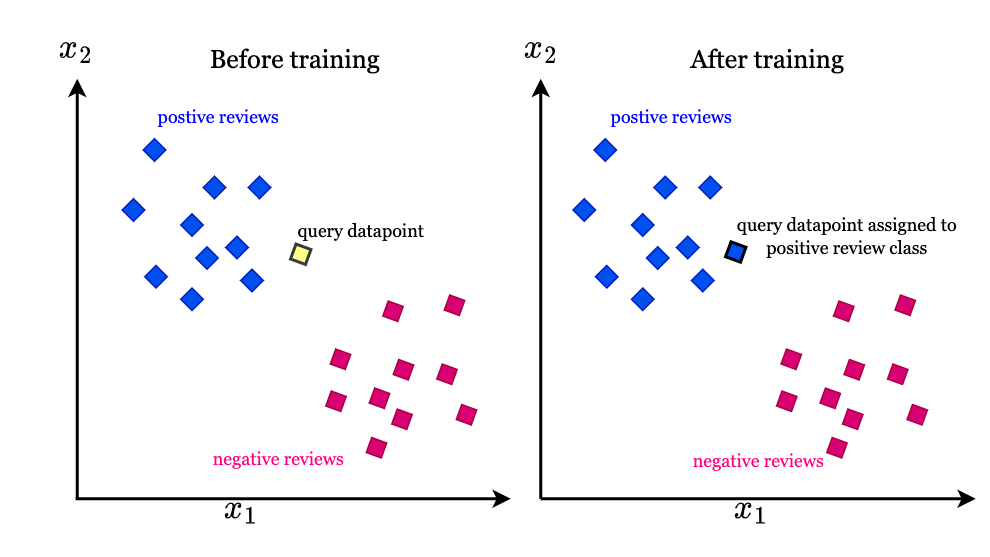

# К-ближайших соседей (K-nearest neighbors)

> Метод классификации "К-ближайших соседей" является 
одним из простых и эффективных алгоритмов машинного обучения. 

>Он основан на идее, что объекты, близкие в пространстве 
признаков, склонны к принадлежности к одному классу.  

##  Порядок действий при использовании метода

Порядок действий в методе "К-ближайших соседей" следующий: 

1. **Задание количества соседей (K):** Сначала необходимо определить 
количество ближайших соседей, которые будут использоваться 
для классификации нового объекта. Это значение может быть выбрано 
на основе эмпирических наблюдений или с использованием метода 
перекрестной проверки (cross-validation). 

2. **Определение метрики расстояния:** Следующий шаг - выбор метрики расстояния, 
которая будет использоваться для измерения близости между объектами. 
Наиболее распространенными метриками являются евклидово расстояние 
и манхэттенское расстояние. Выбор метрики зависит от особенностей данных 
и задачи классификации. 

3. **Вычисление расстояний:** Для классификации нового объекта необходимо 
вычислить расстояние до каждого объекта в обучающей выборке 
с использованием выбранной метрики расстояния. Расстояние может быть 
вычислено путем сравнения значений признаков нового объекта 
с соответствующими значениями признаков объектов обучающей выборки. 

4. **Определение K ближайших соседей:** Из всех объектов обучающей выборки 
выбираются K объектов с наименьшими расстояниями до нового объекта. 
Это можно сделать путем сортировки объектов по расстоянию и выбора 
первых K объектов. 

5. **Принятие решения о классификации:** На основе классов K ближайших 
соседей принимается решение о классификации нового объекта. Например, 
можно использовать голосование большинства: если большинство из 
K ближайших соседей принадлежат к классу "A", то новый объект будет 
отнесен к классу "A". 

6. **Оценка точности классификации:** После классификации нового объекта 
можно оценить точность метода, сравнивая прогнозируемый класс 
с фактическим классом нового объекта. Это может быть особенно полезно 
при использовании метода на обучающей выборке для проверки 
его эффективности. 

## Плюсы и минусы решающих деревьев

### Плюсы

1. **Простота реализации:** 
Метод K-ближайших соседей является простым алгоритмом, который легко 
понять и реализовать. Он не требует сложных математических моделей 
или предположений о данных. 
 
2. **Адаптация к изменениям в данных:** 
Метод K-ближайших соседей хорошо справляется с изменениями в данных 
или добавлением новых объектов. Поскольку классификация нового объекта 
основана на его ближайших соседях, метод может адаптироваться 
к изменениям в структуре данных. 
 
3. **Работа с многомерными признаками:** 
Метод K-ближайших соседей может обрабатывать данные с большим 
количеством признаков. Он не требует предположений о распределении 
данных или линейной зависимости между признаками. 
 
4. **Не требует обучения:** 
Метод K-ближайших соседей не требует предварительного обучения модели 
на большом объеме данных. Он использует только обучающую выборку 
для классификации новых объектов. 
 
5. **Возможность работы с несбалансированными данными:** 
Метод K-ближайших соседей хорошо справляется с несбалансированными 
данными, где количество объектов разных классов существенно отличается. 
Он не предполагает ничего о распределении классов в данных. 
 
6. **Хорошая производительность на небольших выборках:** 
Когда обучающая выборка небольшая, метод K-ближайших соседей может 
показывать хорошую производительность, особенно если данные хорошо 
структурированы. 
 
7. **Возможность использования различных метрик расстояния:** 
Метод K-ближайших соседей позволяет выбрать различные метрики 
расстояния в зависимости от особенностей данных и задачи классификации. 

### Минусы  

1. **Чувствительность к выбору K:** 
Выбор значения K может оказывать значительное влияние на результаты 
классификации. Слишком маленькое значение K может привести 
к переобучению, тогда как слишком большое значение K может привести 
к потере локальной информации и недостаточной гибкости алгоритма. 
 
2. **Затратность по времени:** 
Метод K-ближайших соседей требует вычисления расстояний до всех объектов 
в обучающей выборке при каждой классификации нового объекта. Это может 
быть затратным по времени, особенно при больших объемах данных 
или большом количестве признаков. 
 
3. **Зависимость от масштабирования признаков:** 
Если признаки имеют разные масштабы, то расстояние между объектами 
может быть сильно искажено. Поэтому перед применением метода 
K-ближайших соседей рекомендуется провести масштабирование признаков. 
 
4. **Чувствительность к выбросам:** 
Метод K-ближайших соседей может быть чувствителен к выбросам в данных. 
Один выбросный объект может сильно повлиять на классификацию, особенно 
при малом значении K. 
 
5. **Неэффективность на больших выборках:** 
При большом объеме данных метод K-ближайших соседей может столкнуться 
с проблемами производительности. Хранение и поиск ближайших соседей 
может быть затруднительным и требовать больших вычислительных ресурсов. 
 
6. **Проблема "проклятия размерности":** 
В многомерных пространствах количество объектов может резко уменьшаться 
с увеличением размерности пространства. Это может привести к ухудшению 
производительности метода K-ближайших соседей. 
 
7. **Недостаток учета взаимосвязей между признаками:** 
Метод K-ближайших соседей не учитывает взаимосвязи между признаками 
и предполагает, что все признаки имеют одинаковую важность 
для классификации. В некоторых случаях это может привести 
к неправильным или неоптимальным результатам. 

## Для каких задач можно использовать метод K-ближайших соседей?

Метод K-ближайших соседей может быть использован для решения различных задач, включая: 
 
1. **Классификация:** 
Метод K-ближайших соседей может быть применен для классификации объектов 
на основе их признаков. Например, он может использоваться 
для распознавания образов, определения типа заболевания на основе 
медицинских показателей или классификации текстовых документов. 
 
2. **Регрессия:** 
Метод K-ближайших соседей может использоваться для решения 
задач регрессии, где необходимо предсказать числовое значение на основе 
признаков объекта. Например, он может быть применен для прогнозирования 
цены недвижимости на основе ее характеристик или предсказания спроса 
на товары на основе различных факторов. 
 
3. **Рекомендательные системы:** 
Метод K-ближайших соседей может быть использован для построения 
рекомендательных систем, которые предлагают пользователю наиболее 
подходящие элементы на основе его предпочтений и профиля. Например, 
он может использоваться для рекомендации фильмов, товаров или музыки 
на основе сходства с предпочтениями других пользователей. 
 
4. **Обнаружение выбросов:** 
Метод K-ближайших соседей может использоваться для обнаружения выбросов 
или аномалий в данных. Он может помочь выявить объекты, которые сильно 
отличаются от остальных объектов в выборке. 
 
5. **Кластеризация:** 
Метод K-ближайших соседей может быть использован для разделения объектов 
на группы или кластеры на основе их сходства. Он может помочь выявить 
скрытую структуру в данных и сегментировать их на основе признаков. 

## Примеры использования метода K-ближайших соседей:

#### Задача: Бинарная классификация пассажиров титаника