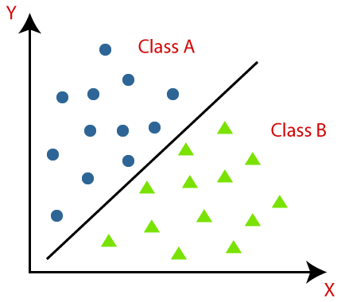

# Классификация

## Определение

Классификация — это задача автоматического определения метки для неразмеченного образца. 
Определение спама — один из ярких примеров классификации.

В машинном обучении задача классификации решается с помощью алгоритма обучения классификации, который на входе принимает набор размеченных данных
и создает модель, которая принимает неразмеченный образец и возвращает либо
его метку непосредственно, либо число, на основании которого аналитик сможет
определить метку. Примером такого числа является вероятность.

## О количестве классов 

В задаче классификации метка является членом конечного множества классов. 
Если размер множества классов равен двум («больной»/«здоровый»,
«спам»/«не_спам»), мы называем такую классификацию бинарной классификацией
(в некоторых источниках ее также называют биномиальной). Классификация
с несколькими классами (также называемая мультиномиальной, или многоклассовой)
— это задача классификации с тремя или более классами.

Некоторые алгоритмы обучения допускают наличие более двух классов, но есть
такие, которые по своей природе являются алгоритмами бинарной классификации.
Существуют стратегии, позволяющие преобразовать алгоритм обучения бинарной
классификации в алгоритм многоклассовой классификации.

## Популярные алгоритмы классификации: 

1. [Наивный Байес](Naive_Bayes/README.md), 
2. [Деревья Решений](DT/README.md), 
3. Логистическая Регрессия, 
4. [K-ближайших соседей](KNN/README.md), 
5. [Машины Опорных Векторов](SVM/README.md), 
