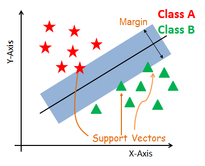

# Машина опорных векторов (support vector machine)

> SVM (Support Vector Machines) — это алгоритм машинного обучения, используемый 
для решения задач классификации, который строит гиперплоскость в n-мерном пространстве 
для разделения объектов двух или более классов. Гиперплоскость выбирается таким образом, 
чтобы максимизировать расстояние между гиперплоскостью и ближайшими объектами 
разных классов (зазор). Объекты, которые расположены ближе всего к гиперплоскости, 
называются опорными векторами.

> Одна из главных идей SVM заключается в том, чтобы преобразовать данные в пространство 
большей размерности, где объекты могут быть более легко разделены гиперплоскостью. 
Это достигается через ядро, которое позволяет выполнить нелинейное преобразование данных, 
сохраняя при этом вычислительную эффективность.

## Как выбрать ядро машины опорных векторов?

Метод опорных векторов (SVM) использует ядро (kernel) для преобразования 
пространства данных, в котором находятся объекты, чтобы разделить их на классы. 
Ядро определяет функцию сходства между объектами в новом пространстве признаков.

Вот четыре основных ядра, которые мы рассмотрим в нашем примере ниже:

1. Линейное ядро (Linear kernel) — это самое простое ядро, которое строит гиперплоскость 
для разделения данных. Оно часто используется в задачах с линейно разделимыми данными. 
В математическом смысле линейное ядро вычисляет скалярное произведение 
между векторами признаков объектов. 

2. Ядро Radial Basis Function (RBF) — это наиболее распространенное ядро, 
которое может разделять данные, не являющиеся линейно разделимыми. 
Оно создает границу принятия решений в виде радиально-симметричного колокола. 

3. Ядро с полиномиальной функцией (Polynomial kernel) — это ядро, 
которое вводит полиномиальную функцию в пространство признаков для разделения данных. 
Это может быть полезно для данных, которые не могут быть разделены гиперплоскостью. 

4. Ядро с сигмоидной функцией (Sigmoid kernel) — это ядро, которое используется 
для моделирования нейронных сетей. Оно может работать с нелинейными данными, 
но не так эффективно, как RBF-ядро.

## Плюсы и минусы машин опорных векторов

### Плюсы

 - Высокая точность: SVM является одним из наиболее точных алгоритмов машинного обучения, 
которые могут обучаться на больших наборах данных.
 - Хорошая работа с высокоразмерными данными: SVM может хорошо работать с данными, 
которые имеют большое количество признаков. 
 - Работает с небольшими выборками данных: SVM может работать с малым количеством данных 
и хорошо обобщать. 
 - Малое количество гиперпараметров: SVM имеет только несколько гиперпараметров, 
что делает его относительно простым для настройки.

### Минусы 

 - Чувствительность к шуму: SVM может быть чувствителен к шуму в данных. 
Шум в данных может привести к тому, что SVM строит границу принятия решений, 
которая не обобщается хорошо на новые данные. 
 - Вычислительная сложность: SVM может быть вычислительно сложным для обучения 
на больших наборах данных. 
 - Выбор функции ядра: Выбор правильной функции ядра может быть сложной задачей. 
Некоторые ядра работают лучше на определенных типах данных, и выбор неправильного ядра 
может привести к плохим результатам.

## Для каких задач можно использованть машины опорных векторов?

Таким образом, идеальные области для применения наивного байесовского классификатора это:

 - Предсказание медицинских диагнозов: Например, если у нас есть данные о состоянии людей 
с определенной болезнью мы можем выявляет узнавать эти состояния у других пациентов 
и предсказывать диагноз.

 - Классификация текстов: Например если у нас есть тексты относящиеся к разным категориям
то вы можем предсказать категории других тестов. Но сперва текст придется векторизировать.

 - Классификация изображений: Изображения предствлящие собой массив пикселей 
тоже можно конвертировать в вектор и тогда их можно успешно классифицировать.

#### Задача: Бинарная классификация новообозований(опухолей) по их характеристикам

- **Датасет:** (*экземпляров - 569, фичей - 30*)   
- **Алгоритм:** SVM (*kernel='linear'*)   
- **Метрика качества:** Точность, F-мера (*Accuracy*, *F1-score*)  
- **Результат:** 96%, 97%
- **Подробности:** [ссылка на colab](https://colab.research.google.com/drive/14Ru1C61wqPsldQPIDRTB-Efx6202P9eE?usp=sharing)
